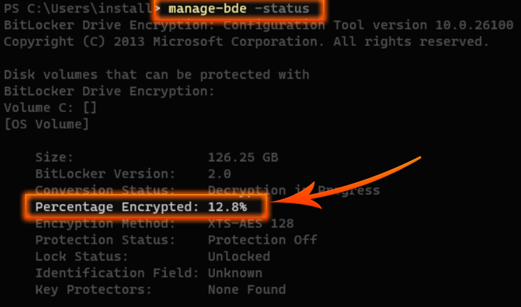
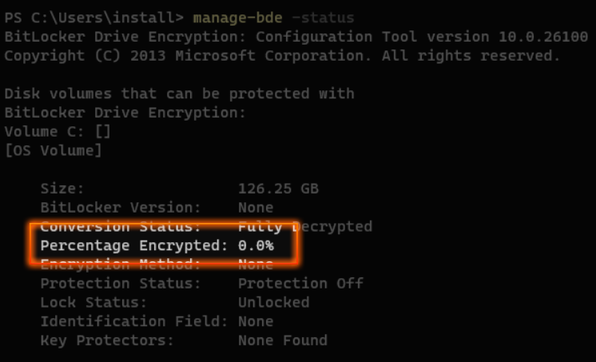

## Remove Some Bloatware and Things Breaking Sysprep in 24H2

```powershell
$bloatapps = @(
"*WindowsMaps",
"MSTeams",
"*YourPhone",
"*Zune*",
"*WindowsMaps",
"*WindowsCamera",
"*WindowsAlarms",
"*Todos",
"*People",
"*MicrosoftOfficeHub",
"*MicrosoftSolitaireCollection",
"*Bing*",
"*windowscommunicationsapps",
"*Clipchamp",
"*OutlookForWindows",
"*Windows.Photos",
"*WindowsSoundRecorder",
"*MicrosoftStickyNotes",
"*Copilot",
"*WindowsFeedbackHub",
"Microsoft.StartExperiencesApp",
"*Widget*",
"*family*"
)

foreach ($bloatapp in $bloatapps)
{
Get-AppxProvisionedPackage -Online | Where "DisplayName" -like $bloatapp | Remove-AppxProvisionedPackage -Online -Verbose
Get-AppxPackage -Name $bloatapp -AllUsers | Remove-AppxPackage -AllUsers -Verbose
}
```
## Disable Bitlocker on Fresh Windows 11 install
```powershell 
manage-bde -off C:
```



### *Repeat to check progress on decryption until fully decrypted*
```powershell
manage-bde -status
```
Check until zero!\




Sysprep should run without complaining! 
